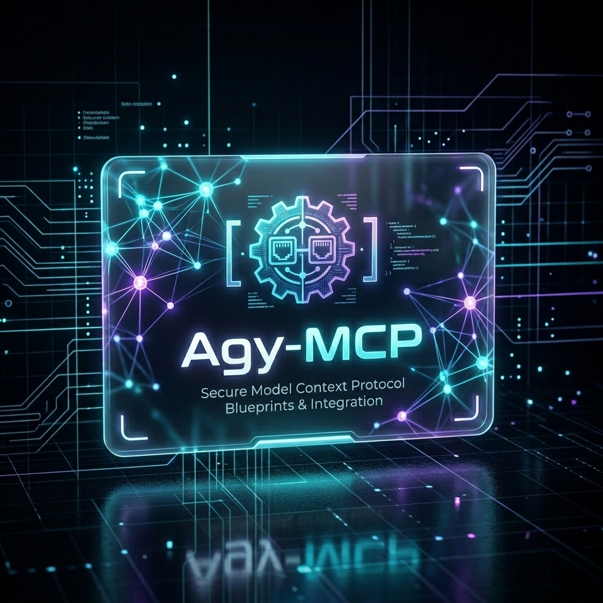

#🛡️ Agy-MCP : Hardened Blueprints for Local MCP Workflows



Agy-MCP is a centralized, self-documenting library of **Model Context Protocol (MCP)** blueprints, schemas, and configurations. It is designed similarly to `Agy-Skills`, housing complete descriptions and instructions for all custom tools and integrations used by AI coding assistants (like Antigravity) to manage and interact with home server infrastructure securely.


---

## 📁 Repository Structure

All MCP server blueprints are located under `mcp-blueprints/`, categorized by server name.

```
Agy-MCP/
├── mcp-blueprints/
│   ├── nas-tools/             # Blueprint for NAS systems and shell automation
│   │   ├── BLUEPRINT.md
│   │   ├── schemas/
│   │   └── templates/
│   │
│   ├── postgres-mcp/          # Blueprint for secure Postgres DB operations
│   │   ├── BLUEPRINT.md
│   │   ├── schemas/
│   │   └── templates/
│   │
│   ├── vault-bridge-mcp/      # Blueprint for Project Fortress secrets management
│   │   ├── BLUEPRINT.md
│   │   └── templates/
│   │
│   ├── data-analyst-mcp/      # Blueprint for structured logs/CSV parsing (In Progress)
│   │   └── BLUEPRINT.md
│   │
│   ├── office-mcp/            # Blueprint for office documents & PDFs builder (In Progress)
│   │   └── BLUEPRINT.md
│   │
│   └── web-search-mcp/        # Blueprint for automated web search indexing (In Progress)
│       └── BLUEPRINT.md
│
├── boilerplates/              # Quickstart code bases for new MCP developments
└── README.md                  # This main directory index

```

---

## 🔒 Security Principles

1. **Zero Raw Secrets:** Never commit real tokens, keys, passwords, or raw environment config files. Always use placeholders (`__SECRET__` or `VAULT_SECRET`) and point to a secure secrets manager (like Project Fortress Vault).
2. **Standardized Schemas:** Tools schemas must be pure JSON and easily reusable across development environments.
3. **AppRole Least Privilege:** Any blueprint utilizing system credentials should outline exact HCL security policies rather than root keys.
