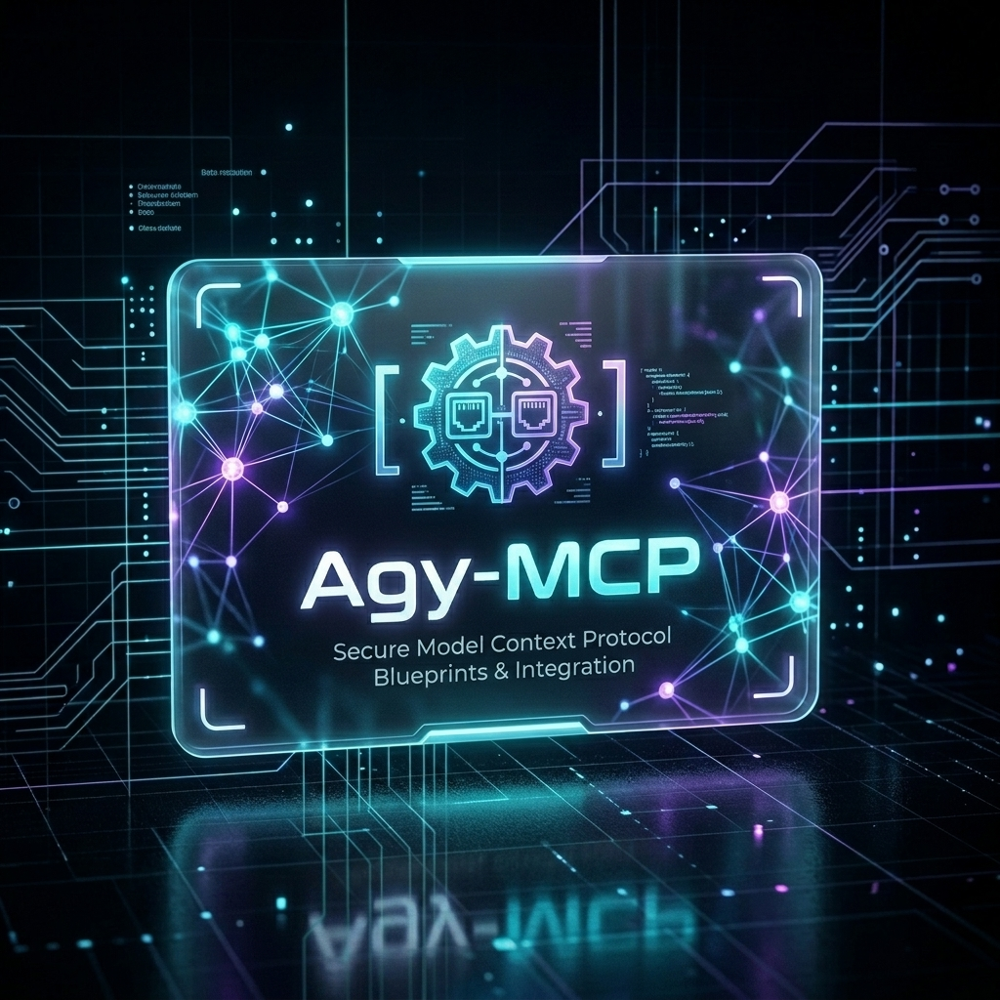

# 🛡️ Agy-MCP: Hardened Blueprints for Local MCP Workflows



Agy-MCP is a centralized, self-documenting library of **Model Context Protocol (MCP)** blueprints, schemas, and configurations. It is designed housing complete descriptions, instructions, and schemas for all tools and integrations used by AI coding assistants to manage and interact with home server infrastructure securely.

---

## 📁 Repository Structure

All MCP server blueprints are located under `mcp-blueprints/`, categorized by server name.

```
Agy-MCP/
├── mcp-blueprints/
│   ├── browser-tools-mcp/     # Browser automation, visual validation & audits (Lighthouse) [NEW]
│   │   ├── BLUEPRINT.md
│   │   └── schemas/tools.json
│   │
│   ├── data-analyst-mcp/      # In-memory CSV/JSON data cleansing & anomaly stats
│   │   ├── BLUEPRINT.md
│   │   └── schemas/tools.json
│   │
│   ├── filesystem-mcp/        # Local filesystem read, write, list and search operations [NEW]
│   │   ├── BLUEPRINT.md
│   │   └── schemas/tools.json
│   │
│   ├── git-mcp/               # Workspace git operations with conventional-commit gates
│   │   ├── BLUEPRINT.md
│   │   └── schemas/tools.json
│   │
│   ├── markitdown-mcp/        # PDF/Word/Excel conversion to Markdown [NEW]
│   │   ├── BLUEPRINT.md
│   │   └── schemas/tools.json
│   │
│   ├── nas-tools/             # Blueprint for NAS systems and shell automation
│   │   ├── BLUEPRINT.md
│   │   └── templates/
│   │
│   ├── office-mcp/            # Microsoft Office Word, Excel, PowerPoint generators
│   │   ├── BLUEPRINT.md
│   │   └── schemas/tools.json
│   │
│   ├── postgres-mcp/          # Secure PostgreSQL DB query & schema explorer
│   │   ├── BLUEPRINT.md
│   │   └── schemas/tools.json
│   │
│   ├── terminal-mcp/          # Validated subprocess shell command executor
│   │   ├── BLUEPRINT.md
│   │   └── schemas/tools.json
│   │
│   ├── searxng-mcp/           # Privacy-respecting web search via local SearXNG engine [NEW]
│   │   ├── BLUEPRINT.md
│   │   └── schemas/tools.json
│   │
│   └── vault-bridge-mcp/      # Secrets bridge to HashiCorp Vault
│       ├── BLUEPRINT.md
│       └── schemas/tools.json
│
├── boilerplates/              # Quickstart code bases for new MCP developments
└── README.md                  # This main directory index
```

---

## 🔒 Security Principles (Hardened Vanilla)

1. **Zero Raw Secrets:** Never commit real tokens, keys, passwords, or raw environment config files. Always use placeholders (`${VAULT_SECRET_<NAME>}`) and point to a secure secrets manager.
2. **Input Validation Schemas:** Every blueprint must contain a `schemas/tools.json` file defining strict parameters, types, `maxLength`, pattern regex, `minimum`/`maximum`, and array bounds (`maxItems`) to reject malformed inputs at the protocol layer.
3. **Least Privilege Design:** Any blueprint utilizing system credentials should restrict access to designated namespaces (e.g. `dev`, `staging`, `production`) and limit actions (e.g., read-only by default for SQL databases, no force pushes for git).
4. **Atomic Write Strategy:** Write operations that mutate files must first write to a `.tmp` buffer file and atomically rename it to the target path.
