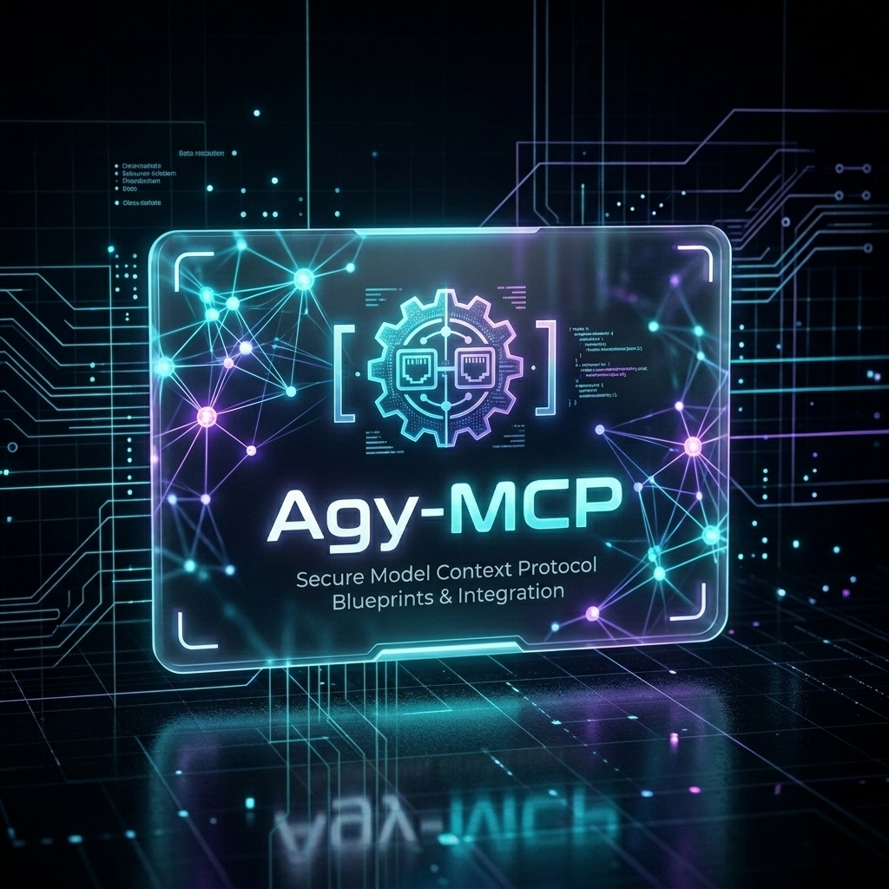

# 🛡️ Agy-MCP: Hardened Blueprints for Local MCP Workflows



Agy-MCP is a centralized, self-documenting library of **Model Context Protocol (MCP)** blueprints, schemas, and configurations. It is designed to house complete architectural specifications, operational runbooks, and strict JSON Schemas for all tools and integrations used by AI coding assistants to manage workflows and server infrastructure safely.

---

## 📁 Repository Structure

All MCP server blueprints are located under `mcp-blueprints/`, categorized by server name.

```
Agy-MCP/
├── mcp-blueprints/
│   ├── backup-mcp/            # Read-only backup infrastructure freshness & job status
│   │   ├── BLUEPRINT.md
│   │   └── schemas/tools.json
│   │
│   ├── browser-tools-mcp/     # Browser automation, visual validation & Lighthouse audits
│   │   ├── BLUEPRINT.md
│   │   └── schemas/tools.json
│   │
│   ├── connectwise-mcp/       # ConnectWise PSA tickets & RMM endpoint monitoring
│   │   ├── BLUEPRINT.md
│   │   └── schemas/tools.json
│   │
│   ├── data-analyst-mcp/      # 11-tool Universal Data & Document Processing Suite
│   │   ├── BLUEPRINT.md
│   │   └── schemas/tools.json
│   │
│   ├── filesystem-mcp/        # Sandboxed local filesystem read, write, list, move and search
│   │   ├── BLUEPRINT.md
│   │   └── schemas/tools.json
│   │
│   ├── git-mcp/               # Workspace git operations with conventional-commit gates
│   │   ├── BLUEPRINT.md
│   │   └── schemas/tools.json
│   │
│   ├── markitdown-mcp/        # PDF/Word/Excel/Audio conversion to Markdown
│   │   ├── BLUEPRINT.md
│   │   └── schemas/tools.json
│   │
│   ├── nas-tools/             # [RETIRED] Migrated to native Docker CLI and PowerShell
│   │   └── BLUEPRINT.md
│   │
│   ├── office-mcp/            # 5-tool Office Authoring (Word, Excel, PowerPoint, PDF)
│   │   ├── BLUEPRINT.md
│   │   └── schemas/tools.json
│   │
│   ├── postgres-mcp/          # Secure PostgreSQL DB query & schema explorer
│   │   ├── BLUEPRINT.md
│   │   └── schemas/tools.json
│   │
│   ├── searxng-mcp/           # Privacy-respecting web search via local SearXNG engine
│   │   ├── BLUEPRINT.md
│   │   └── schemas/tools.json
│   │
│   ├── security-scanner-mcp/  # Host OS hardening, socket audit, CVE checks & finding validation
│   │   ├── BLUEPRINT.md
│   │   └── schemas/tools.json
│   │
│   ├── terminal-mcp/          # Validated subprocess shell command executor
│   │   ├── BLUEPRINT.md
│   │   └── schemas/tools.json
│   │
│   ├── vault-bridge-mcp/      # Secrets bridge to HashiCorp Vault
│   │   ├── BLUEPRINT.md
│   │   └── schemas/tools.json
│   │
│   └── web-search-mcp/        # Web search querying and content citation extraction
│       ├── BLUEPRINT.md
│       └── schemas/tools.json
│
├── boilerplates/              # Quickstart code bases for new MCP developments
└── README.md                  # This main directory index
```

---

## 🧩 Blueprint Catalog & Capabilities

| Blueprint Server | Runtime | Tools Count | Primary Scope & Capabilities |
| :--- | :--- | :---: | :--- |
| **`backup-mcp`** | Node.js / Python | 3 | Read-only backup appliance freshness, job status verification (Veeam/Axcient), and history logs |
| **`browser-tools-mcp`** | Node.js / npx | 19 | Browser automation, visual regressions, DOM inspection, and Lighthouse audits |
| **`connectwise-mcp`** | Node.js / Python | 5 | ConnectWise Manage PSA ticket management, company configuration discovery, and RMM endpoint monitoring |
| **`data-analyst-mcp`** | Node.js | 11 | Multi-format ingestion (CSV, Excel, PDF, Word, PPTX, HTML, Logs), data hygiene, stats metrics, and OCR |
| **`filesystem-mcp`** | Node.js / npx | 9 | Sandboxed local filesystem operations (read, write, list, search, move, get file info) |
| **`git-mcp`** | Python / uvx | 7 | Conventional-commit gated git status, branch, log, diff, commit, and status inspection |
| **`markitdown-mcp`** | Python >= 3.10 | 1 | Multi-format document to Markdown conversion (`convert_to_markdown`) |
| **`nas-tools`** | *RETIRED* | 0 | Retired 2026-09-28. Replaced with native Docker CLI and Windows PowerShell |
| **`office-mcp`** | Node.js | 5 | Styled Word (.docx), Excel (.xlsx), PowerPoint (.pptx), PDF (.pdf) generation & OOXML inspection |
| **`postgres-mcp`** | Python uvx / Node | 6 | Secure PostgreSQL schema exploration, table inspection, explain plans, and parameterized queries |
| **`searxng-mcp`** | Node.js | 1 | Privacy-respecting web search via local or network SearXNG instance |
| **`security-scanner-mcp`** | Python / Node | 4 | Host OS auditing, open listening socket scans, CVE audits, and finding schema validations |
| **`terminal-mcp`** | Node.js | 4 | Sandboxed subprocess command execution with timeout and output guards |
| **`vault-bridge-mcp`** | Node.js | 5 | HashiCorp Vault KV v2 credential storage, retrieval, rotation, and audit logs |
| **`web-search-mcp`** | Node.js / npx | 2 | Web search querying and structured citation extraction (Brave Search / SearXNG) |

---

## 🗺️ Skill-to-MCP Dependency Mapping

| Agy-Skill | Primary MCP Servers Used | Fallback When MCP Unavailable |
| :--- | :--- | :--- |
| `browser_testing` | `browser-tools-mcp` | Native browser automation / Playwright CLI |
| `database_management` (`db-manager`) | `postgres-mcp` | `psql` / database CLI / GUI client |
| `managing_secrets_and_vaults` | `vault-bridge-mcp` | Environment variables / CLI vault commands |
| `sec_engineer` | `browser-tools-mcp`, `security-scanner-mcp` | Native `docker inspect`, `curl -I`, `safety check` |
| `host_security_audit` | `security-scanner-mcp` | Native Linux/Windows CLI (`netstat`, `ss`, `auditd`) |
| `security_audit` | `security-scanner-mcp` | Manual dependency scans (`npm audit`, `trivy`) |
| `general_network_audit` | `security-scanner-mcp` | Native `netstat -ano`, PowerShell `Test-NetConnection` |
| `seo_audit` | `web-search-mcp`, `markitdown-mcp`, `browser-tools-mcp` | Native web fetch / Google PageSpeed web UI |
| `client_onboarding` | `connectwise-mcp`, `vault-bridge-mcp` | ConnectWise web portal / PowerShell Graph |
| `patch_management` | `connectwise-mcp`, `backup-mcp`, `terminal-mcp` | Vendor RMM portal / manual script deployment |
| `incident_response` | `connectwise-mcp`, `data-analyst-mcp`, `vault-bridge-mcp` | PowerShell Microsoft Graph / manual incident triage |
| `managing_system_operations` | `filesystem-mcp` | Native PowerShell (`Get-PSDrive`), POSIX (`df -h`) |
| `documenting_sessions` (`docum-md`) | `filesystem-mcp`, `git-mcp` | Native file writes, `attrib +h`, `icacls` |

---

## 🔒 Security Principles (Hardened Vanilla)

1. **Zero Raw Secrets:** Never commit real tokens, keys, passwords, or raw environment config files. Always use placeholders (`${VAULT_SECRET_<NAME>}`) and point to a secure secrets manager.
2. **Input Validation Schemas:** Every blueprint must contain a `schemas/tools.json` file defining strict parameters, types, `maxLength`, pattern regex, `minimum`/`maximum`, and array bounds (`maxItems`) to reject malformed inputs at the protocol layer.
3. **Verified Packages Only:** Every external package in a deployment snippet must exist on npm or PyPI, must not be deprecated, and must not resolve to a security placeholder (`0.0.1-security`).
4. **Least Privilege Design:** Any blueprint utilizing system credentials should restrict access to designated namespaces (e.g. `dev`, `staging`, `production`) and limit actions (e.g., read-only by default for SQL databases, no force pushes for git).
5. **Atomic Write Strategy:** Write operations that mutate files must first write to a `.tmp` buffer file and atomically rename it to the target path.

---
**Created by:** Jimmy Rauseo  
**Powered by:** Antigravity / Gemini
