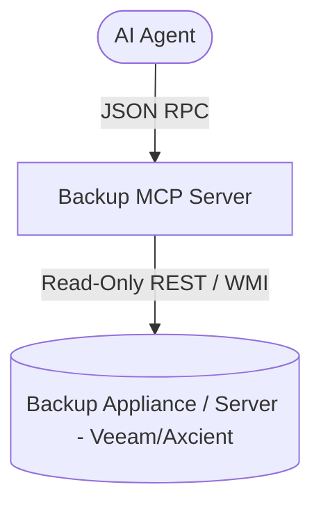

# Agy-MCP Blueprint: Backup MCP 💾

This MCP server provides a standardized, read-only interface to backup infrastructure solutions (such as Veeam Backup & Replication, Axcient x360Recover, or Datto BCDR), enabling agents to verify backup freshness, job execution status, and recovery point objectives (RPO).

## 1. Architectural Overview



## 2. Setup Requirements

- **Runtime:** Node.js >= 18 or Python >= 3.11
- **API Access:** Scoped read-only API token or service user for backup management software.

## 3. Environment Configuration (`.env.example`)

Inject all credentials via HashiCorp Vault (`vault-bridge-mcp`):
```env
# 💾 BACKUP APPLIANCE CREDENTIALS
BACKUP_PROVIDER=veeam
BACKUP_SERVER_URL=https://backup.corp.internal:9398
BACKUP_API_TOKEN=${VAULT_SECRET_BACKUP_API_TOKEN}
```

## 4. Least Privilege Design

- **Strictly Read-Only:** The server exposes zero destructive or mutation actions (no job triggering, no job deletion, no restore execution).
- **Target Filtering:** Job queries enforce alphanumeric name filters to prevent injection.

## 5. Atomic Write Strategy

- All telemetry data is returned in-memory as JSON; no persistent local files are modified.

## 6. Multi-Agent Deployment & Verification Plan

### ▶️ If you are on Antigravity / Hermes Agent:
Configure in `mcp_config.json`:
```json
{
  "mcpServers": {
    "backup": {
      "command": "node",
      "args": ["./mcps/backup-mcp/index.js"],
      "env": {
        "BACKUP_SERVER_URL": "https://backup.corp.internal:9398",
        "BACKUP_API_TOKEN": "${VAULT_SECRET_BACKUP_API_TOKEN}"
      }
    }
  }
}
```

### ▶️ If you are on Cline / Roo Code / OpenCode:
```json
{
  "mcpServers": {
    "backup": {
      "command": "node",
      "args": ["./mcps/backup-mcp/index.js"]
    }
  }
}
```

### ⚠️ If you do NOT have MCP support (Fallback):
- Check backup status directly via the vendor web management console (e.g. Veeam Enterprise Manager, Axcient portal).
- Run vendor PowerShell modules locally (e.g., `Get-VBRJob | Select-Object Name, LastResult`).

Verify installation by calling `list_backup_jobs`.

---
**Author:** JimmyR  
**Powered by:** AntigravityAI
