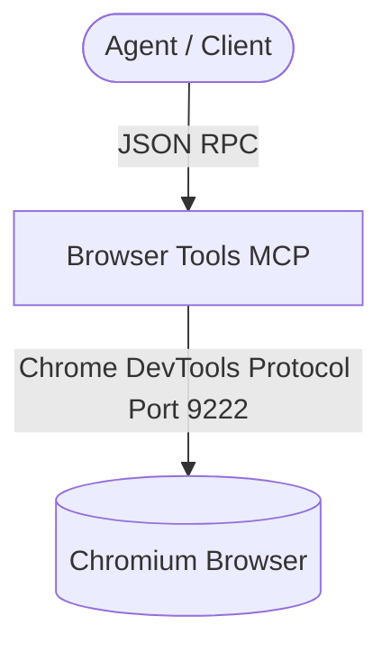

# Agy-MCP Blueprint: Browser Tools MCP 🌐

This MCP server provides a standardized, secure connection to a Chromium-based browser via Chrome DevTools protocol, allowing automated testing, accessibility auditing, performance tracing, and visual regression checks.

## 1. Architectural Overview

The Browser Tools MCP server coordinates commands between the agent and a running Chrome instance.



## 2. Setup Requirements

- **Runtime:** Node.js >= 18
- **Browser:** Google Chrome or Chromium installed on the host.
- **Port:** Port 9222 must be free for remote debugging.

## 3. Environment Configuration (`.env.example`)

Create a `.env` file from this template. No credentials should be hardcoded:
```env
# 🌐 BROWSER PORT CONFIG
BROWSER_PORT=9222
BROWSER_HOST=${TARGET_HOST}
```

## 4. Least Privilege Design

- The browser instance is launched with isolated user data profile (`--user-data-dir`).
- The MCP server only exposes browser interactions and navigation, not direct shell access.
- Restrict remote debugging to localhost or specific internal proxy IP ranges.

## 5. Atomic Write Strategy

- When capturing screenshots, they are written to a `.tmp` file and renamed to the target filename to prevent corruption.

## 6. Deployment / Verification Plan

Deploy the MCP using the npx command:
```json
{
  "mcpServers": {
    "browser-tools": {
      "command": "npx",
      "args": ["-y", "@modelcontextprotocol/server-devtools", "--port", "9222"]
    }
  }
}
```
Verify the connection using `list_pages` to confirm the browser is reachable.
