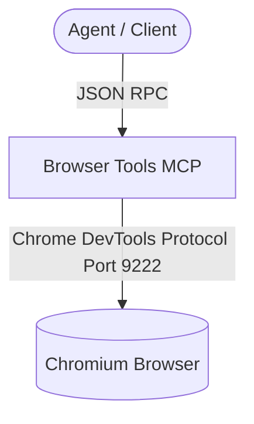

# Agy-MCP Blueprint: Browser Tools MCP 🌐

This MCP server provides a standardized, secure connection to a Chromium-based browser via Chrome DevTools protocol, allowing automated testing, accessibility auditing, performance tracing, and visual regression checks.

## 1. Architectural Overview

The Browser Tools MCP server coordinates commands between the agent and a running Chrome instance.


```mermaid
graph TD
    Agent([Agent / Client]) -->|JSON RPC| MCP[Browser Tools MCP]
    MCP -->|Chrome DevTools Protocol Port 9222| Chrome[(Chromium Browser)]
```

## 2. Setup Requirements

- **Runtime:** Node.js >= 18
- **Browser:** Google Chrome or Chromium installed on the host.
- **Port:** Port 9222 must be free for remote debugging (or launch isolated profile via CLI flag).

## 3. Environment Configuration (`.env.example`)

Create a `.env` file from this template. No credentials should be hardcoded:
```env
# 🌐 BROWSER PORT CONFIG
BROWSER_PORT=9222
BROWSER_HOST=localhost
```

## 4. Least Privilege Design

- The browser instance is launched with an isolated user data profile (`--isolated`), using a throwaway profile to prevent cookie or credential leaks.
- The MCP server only exposes browser interactions and navigation, not direct host shell access.
- Remote debugging binds exclusively to `localhost`.

## 5. Atomic Write Strategy

- When capturing screenshots, data is written to a `.tmp` file and atomically renamed to the target filename to prevent corruption.

## 6. Multi-Agent Deployment & Verification Plan

### ▶️ If you are on Antigravity / Hermes Agent:
Deploy the MCP using the official Chrome DevTools package:
```json
{
  "mcpServers": {
    "browser-tools": {
      "command": "npx",
      "args": ["-y", "chrome-devtools-mcp@latest", "--isolated"]
    }
  }
}
```

### ▶️ If you are on Cline / Roo Code / OpenCode:
```json
{
  "mcpServers": {
    "browser-tools": {
      "command": "npx",
      "args": ["-y", "chrome-devtools-mcp@latest", "--isolated"]
    }
  }
}
```

### ⚠️ If you do NOT have MCP support (Fallback):
- Use built-in browser automation tools (such as Antigravity's native browser tools).
- For headless execution, run Playwright/Puppeteer CLI test scripts.

Verify the connection by calling `new_page` then `take_snapshot` to confirm DOM rendering.

---
**Author:** JimmyR  
**Powered by:** AntigravityAI
