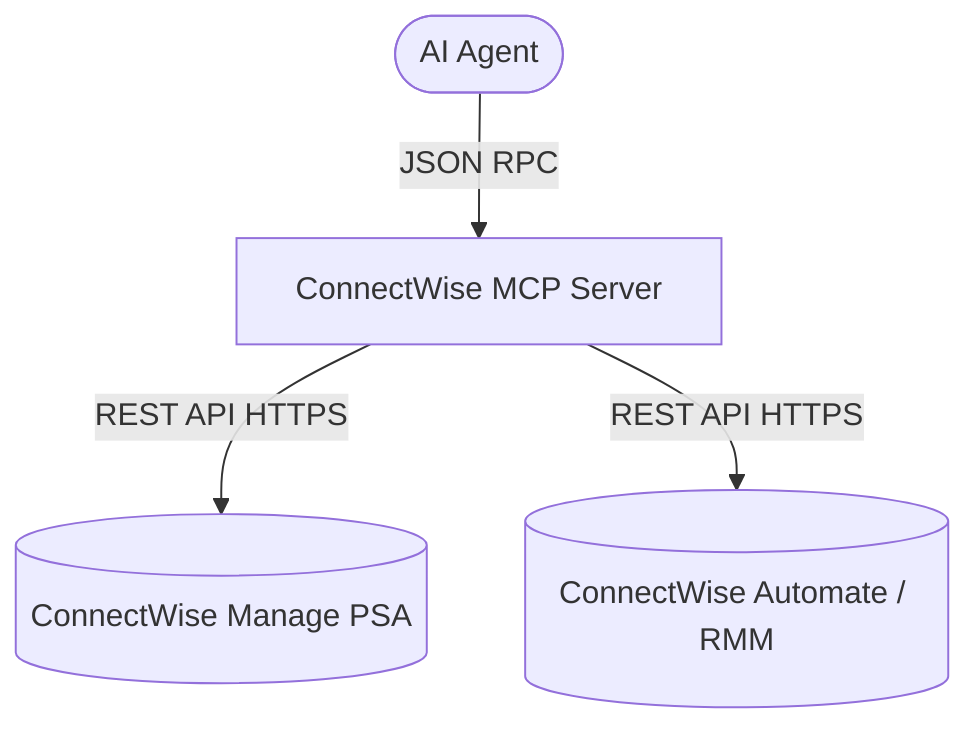

# Agy-MCP Blueprint: ConnectWise PSA/RMM MCP 💼

This MCP server provides a secure reference connector to ConnectWise Manage (PSA) and ConnectWise Automate/Command (RMM), allowing agents to inspect service tickets, view client company configurations, audit managed endpoints, and update service entries with vault-injected API credentials.

## 1. Architectural Overview



## 2. Setup Requirements

- **Runtime:** Node.js >= 18 or Python >= 3.11
- **API Access:** ConnectWise Manage API Member with scoped security permissions (Service Desk, Company, Configurations).

## 3. Environment Configuration (`.env.example`)

Inject all API keys through HashiCorp Vault (`vault-bridge-mcp`):
```env
# 💼 CONNECTWISE CREDENTIALS
CW_COMPANY_ID=${VAULT_SECRET_CW_COMPANY_ID}
CW_PUBLIC_KEY=${VAULT_SECRET_CW_PUBLIC_KEY}
CW_PRIVATE_KEY=${VAULT_SECRET_CW_PRIVATE_KEY}
CW_CLIENT_ID=${VAULT_SECRET_CW_CLIENT_ID}
CW_BASE_URL=https://api-na.myconnectwise.net/v4_6_release/apis/3.0
```

## 4. Least Privilege Design

- **Read-Only Defaults:** Inspection of clients, configs, and endpoints is read-only.
- **Scaped Updates:** Ticket modifications are restricted to adding internal notes or updating status fields; client deletion and billing mutations are explicitly disallowed.
- **Identifier Validation:** Ticket IDs, Company IDs, and Configuration IDs require numeric or alphanumeric validation.

## 5. Atomic Write Strategy

- Updates to tickets or service notes are submitted as individual transactional REST requests; failed requests abort without caching partial updates.

## 6. Multi-Agent Deployment & Verification Plan

### ▶️ If you are on Antigravity / Hermes Agent:
Configure in `mcp_config.json`:
```json
{
  "mcpServers": {
    "connectwise": {
      "command": "node",
      "args": ["./mcps/connectwise-mcp/index.js"],
      "env": {
        "CW_COMPANY_ID": "${VAULT_SECRET_CW_COMPANY_ID}",
        "CW_PUBLIC_KEY": "${VAULT_SECRET_CW_PUBLIC_KEY}",
        "CW_PRIVATE_KEY": "${VAULT_SECRET_CW_PRIVATE_KEY}",
        "CW_CLIENT_ID": "${VAULT_SECRET_CW_CLIENT_ID}",
        "CW_BASE_URL": "https://api-na.myconnectwise.net/v4_6_release/apis/3.0"
      }
    }
  }
}
```

### ▶️ If you are on Cline / Roo Code / OpenCode:
```json
{
  "mcpServers": {
    "connectwise": {
      "command": "node",
      "args": ["./mcps/connectwise-mcp/index.js"]
    }
  }
}
```

### ⚠️ If you do NOT have MCP support (Fallback):
- Access the ConnectWise Manage web portal directly.
- Use vendor REST API directly via PowerShell: `Invoke-RestMethod` with Basic Auth credentials.

Verify installation by calling `cw_list_tickets` with `limit: 1`.

---
**Author:** JimmyR  
**Powered by:** AntigravityAI
