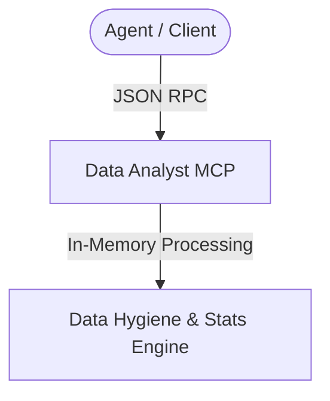

# Agy-MCP Blueprint: Data Analyst MCP 📊

This MCP server provides standard data ingestion, cleaning, metrics calculation, and statistical anomaly detection capabilities.

## 1. Architectural Overview

The Data Analyst MCP server processes raw data sets (CSV, JSON) and returns sanitized metrics or anomalies.



## 2. Setup Requirements

- **Runtime:** Node.js >= 18 or Python >= 3.10
- **Libraries:** Pandas (if Python) or Arquero/D3-dsv (if Node.js)

## 3. Environment Configuration (`.env.example`)

No credentials needed:
```env
# 📊 MAXIMUM ROW LIMIT
MAX_ROWS_LIMIT=100000
```

## 4. Least Privilege Design

- Input files must reside in the allowed workspaces.
- In-memory data structures are capped to prevent memory exhaustion (DoS).

## 5. Atomic Write Strategy

- Exported summaries are written to a `.tmp` file first and atomically renamed.

## 6. Deployment / Verification Plan

Register the server in `mcp_config.json`:
```json
{
  "mcpServers": {
    "data-analyst": {
      "command": "python",
      "args": ["-m", "data_analyst_mcp"]
    }
  }
}
```
Verify by calling `parse_csv` on a small dataset.
