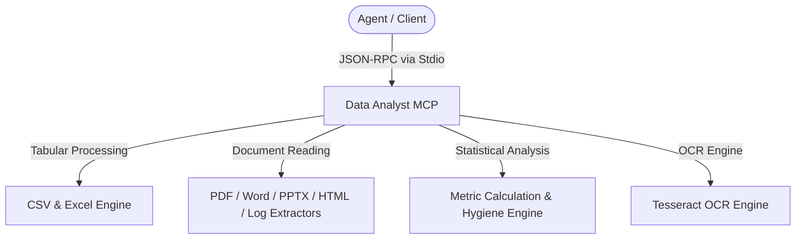

# Agy-MCP Blueprint: Data Analyst MCP 📊

This MCP server provides a comprehensive, multi-modal **11-tool Universal Data & Document Processing Suite** for AI agents. It enables tabular data ingestion, multi-format document reading (PDF, Word, PowerPoint, HTML, Text, Logs), automated data hygiene, statistical metric computation, and OCR text extraction.

## 1. Architectural Overview



## 2. Tool Inventory (11 Tools)

| Tool Name | Scope | Description |
| :--- | :--- | :--- |
| `parse_csv` | Tabular | Ingest and parse local CSV files with delimiter and row limit controls. |
| `parse_excel` | Tabular | Parse Microsoft Excel (.xlsx/.xls) spreadsheets across sheets with preview options. |
| `extract_pdf_data` | Document | Extract text, page structures, and metadata from local PDF documents. |
| `read_word_document` | Document | Read and extract formatted text, headings, and tables from Word (.docx) files. |
| `read_powerpoint_presentation` | Document | Read and extract slide text, structure, and speaker notes from PowerPoint (.pptx). |
| `read_text_file` | General | Read raw text, markdown, configuration, or source code files with line range selection. |
| `read_html_content` | Document | Parse local HTML files or clippings into structured, stripped text or markdown. |
| `parse_log_file` | Observability | Ingest and structure server and application logs with timestamp and regex filtering. |
| `calculate_metrics` | Analytics | Compute statistical aggregations (sums, averages, medians, std dev, min/max) on numeric columns. |
| `clean_tabular_data` | Hygiene | Sanitize tabular datasets (null handling, whitespace trimming, deduplication, casing). |
| `extract_text_from_image` | Vision / OCR | Optical Character Recognition (OCR) to extract text and data from image files. |

## 3. Setup Requirements

- **Runtime:** Node.js >= 18 or Python >= 3.10
- **Native / Core Dependencies:**
  - Tabular: `papaparse` / `xlsx` (Node.js) or `pandas` / `openpyxl` (Python)
  - Documents: `pdf-parse`, `mammoth`, `officegen` (Node.js) or `pypdf`, `python-docx`, `python-pptx` (Python)
  - Vision: `tesseract.js` (Node.js) or `pytesseract` (Python)

## 4. Environment Configuration (`.env.example`)

```env
# Maximum row limit for in-memory tabular parsing
MAX_ROWS_LIMIT=100000

# OCR language profile (defaults to eng)
OCR_DEFAULT_LANG=eng
```

## 5. Security & Least Privilege Design

- **Path Sandboxing:** File operations must resolve strictly within permitted workspace directories.
- **Resource Limits:** In-memory streams and file size guards prevent unbounded memory consumption or denial-of-service.
- **Read-Only Ingestion:** Ingestion operations do not alter original source documents.

## 6. Client Manifest Example

```json
{
  "mcpServers": {
    "data-analyst": {
      "command": "node",
      "args": ["/path/to/data-analyst-mcp/index.js"],
      "env": {
        "MAX_ROWS_LIMIT": "100000"
      }
    }
  }
}
```

Verify deployment by invoking `parse_csv` or `calculate_metrics` against sample data.

---
**Author:** JimmyR  
**Powered by:** AntigravityAI
