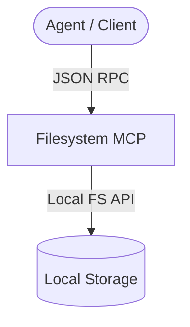

# Agy-MCP Blueprint: Filesystem MCP 📂

This MCP server provides standard, secure local filesystem operations (reading, writing, directory listing, searching) with path-isolation bounds and strict file-size constraints.

## 1. Architectural Overview

The Filesystem MCP maps client file requests to local filesystem calls under strict boundary limits.



## 2. Setup Requirements

- **Runtime:** Node.js >= 18
- **Packages:** `@modelcontextprotocol/server-filesystem`
- **Paths:** Explicit allowlisted directories must be passed at runtime.

## 3. Environment Configuration (`.env.example`)

No credentials should be stored. Configuration of allowlisted directories:
```env
# 📂 ALLOWLISTED DIRECTORIES (Comma-separated)
ALLOWED_PATHS=${AGY_SKILLS_DIR},${AGY_MCP_DIR}
```

## 4. Least Privilege Design

- Only directories explicitly passed as arguments to the server can be accessed.
- Symbolic links outside the allowed paths are blocked.
- Write operations are restricted to prevent modifying system-critical directories (like Windows system32).

## 5. Atomic Write Strategy

- Writing or editing a file must first write to a `.tmp` file within the same directory, followed by an atomic rename operation.

## 6. Deployment / Verification Plan

Deploy using npx, specifying allowlisted paths:
```json
{
  "mcpServers": {
    "filesystem": {
      "command": "npx",
      "args": ["-y", "@modelcontextprotocol/server-filesystem", "C:\\Users\\JimmyR\\OneDrive\\Documentos\\Projects"]
    }
  }
}
```
Verify by calling `list_directory` on an allowed path to confirm files can be read.
