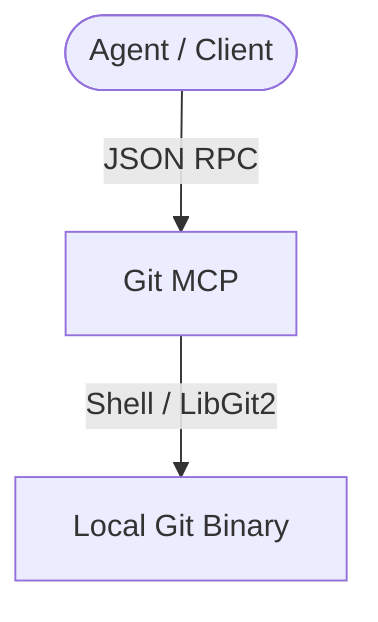

# Agy-MCP Blueprint: Git MCP 🌿

This MCP server provides Git version control integrations, enabling repo state inspection, diff comparisons, blame lookups, and structured commits with conventional-commit constraints.

## 1. Architectural Overview

The Git MCP communicates with local git binaries, applying strict validation filters on execution parameters.



## 2. Setup Requirements

- **Runtime:** Node.js >= 18
- **Binary:** Git CLI installed and in system PATH.

## 3. Environment Configuration (`.env.example`)

No credentials in configuration. Author credentials setup:
```env
# 🌿 GIT COMMIT AUTHOR IDENTITIES
GIT_AUTHOR_NAME=${GIT_AUTHOR_NAME}
GIT_AUTHOR_EMAIL=${GIT_AUTHOR_EMAIL}
```

## 4. Least Privilege Design

- Push operations explicitly block `--force` or `--force-with-lease` parameters.
- Pull/fetch are allowed but restricted to origin.
- Branch deletion or rebasing is restricted.

## 5. Atomic Write Strategy

- Commit operations are committed atomically using Git's lock system.

## 6. Deployment / Verification Plan

Register the Git server:
```json
{
  "mcpServers": {
    "git": {
      "command": "npx",
      "args": ["-y", "@modelcontextprotocol/server-git"]
    }
  }
}
```
Verify by calling `git_status` on the workspace.
