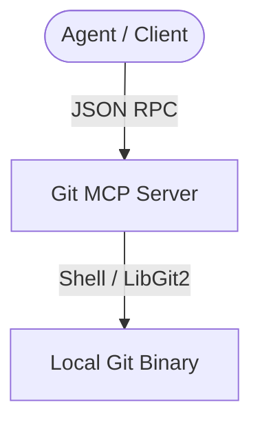

# Agy-MCP Blueprint: Git MCP 🌿

This MCP server provides Git version control integrations, enabling repo state inspection, diff comparisons, status checks, and structured commits with conventional-commit constraints.

> [!NOTE]
> **Upstream Scope Note:** The official upstream PyPI package `mcp-server-git` does not expose `git_push` or `git_blame`. All repository push operations should remain manual and human-approved.

## 1. Architectural Overview

The Git MCP communicates with local git binaries, applying strict validation filters on execution parameters.


```mermaid
graph TD
    Agent([Agent / Client]) -->|JSON RPC| MCP[Git MCP Server]
    MCP -->|Shell / LibGit2| Git[Local Git Binary]
```

## 2. Setup Requirements

- **Runtime:** Python >= 3.10 with `uv` / `uvx`
- **Binary:** Git CLI installed and available in system PATH.

## 3. Environment Configuration (`.env.example`)

No credentials in configuration. Author credentials setup:
```env
# 🌿 GIT COMMIT AUTHOR IDENTITIES
GIT_AUTHOR_NAME=${GIT_AUTHOR_NAME}
GIT_AUTHOR_EMAIL=${GIT_AUTHOR_EMAIL}
WORKSPACE_PATH=${WORKSPACE_PATH}
```

## 4. Least Privilege Design

- Push operations explicitly block `--force` or `--force-with-lease` parameters.
- Pull/fetch are allowed but restricted to configured tracking remotes.
- Branch deletion or destructive rebasing is prohibited via MCP.

## 5. Atomic Write Strategy

- Commit operations are committed atomically using Git's index locking mechanism (`.git/index.lock`).

## 6. Multi-Agent Deployment & Verification Plan

### ▶️ If you are on Antigravity / Hermes Agent:
Register the Git server in `mcp_config.json`:
```json
{
  "mcpServers": {
    "git": {
      "command": "uvx",
      "args": ["mcp-server-git", "--repository", "${WORKSPACE_PATH}"]
    }
  }
}
```

### ▶️ If you are on Cline / Roo Code / OpenCode:
```json
{
  "mcpServers": {
    "git": {
      "command": "uvx",
      "args": ["mcp-server-git", "--repository", "${WORKSPACE_PATH}"]
    }
  }
}
```

### ⚠️ If you do NOT have MCP support (Fallback):
- Run git commands via standard terminal (`git status`, `git diff`, `git log -n 5`).
- Ensure all remote push operations are initiated or reviewed by a human operator.

Verify installation by calling `git_status` on the active workspace.

---
**Author:** JimmyR  
**Powered by:** AntigravityAI
