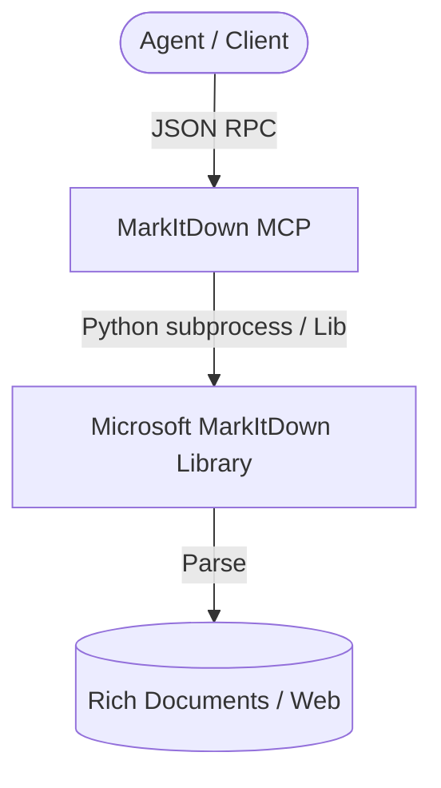

# Agy-MCP Blueprint: MarkItDown MCP 📝

This MCP server wraps Microsoft's MarkItDown library, enabling the conversion of rich media and document formats (PDF, Word, Excel, PowerPoint, HTML) into clean Markdown files.

## 1. Architectural Overview

The MarkItDown MCP server takes binary files or URLs and converts them to Markdown content for parsing.



## 2. Setup Requirements

- **Runtime:** Python >= 3.10
- **Libraries:** `pip install markitdown[mcp]`

## 3. Environment Configuration (`.env.example`)

No credentials should be stored. Configuration of execution variables:
```env
# 🐍 PYTHON PATH CONFIG
PYTHON_PATH=python
```

## 4. Least Privilege Design

- The tool only accesses files within allowed/active workspaces.
- External URL ingestion forces HTTPS-only redirection validation where applicable.

## 5. Atomic Write Strategy

- The output markdown content is returned as standard text output in JSON. If written to disk, it must use the atomic rename strategy (.tmp buffer).

## 6. Deployment / Verification Plan

Deploy using node/npx or Python command line:
```json
{
  "mcpServers": {
    "markitdown": {
      "command": "python",
      "args": ["-m", "markitdown.mcp"]
    }
  }
}
```
Verify the connection by calling `convert_file` on a test document to confirm markdown is returned.
