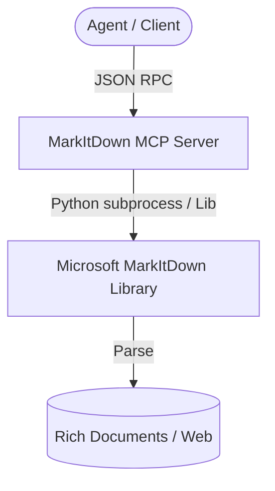

# Agy-MCP Blueprint: MarkItDown MCP 📝

This MCP server wraps Microsoft's MarkItDown library, enabling the conversion of rich media and document formats (PDF, Word, Excel, PowerPoint, HTML, Audio) into clean Markdown files via a single canonical `convert_to_markdown` tool.

## 1. Architectural Overview

The MarkItDown MCP server takes binary files or URLs and converts them to Markdown content for parsing.


```mermaid
graph TD
    Agent([Agent / Client]) -->|JSON RPC| MCP[MarkItDown MCP Server]
    MCP -->|Python subprocess / Lib| MID[Microsoft MarkItDown Library]
    MID -->|Parse| Doc[(Rich Documents / Web)]
```

## 2. Setup Requirements

- **Runtime:** Python >= 3.10
- **Package Installation:**
  ```bash
  pip install markitdown-mcp
  ```

## 3. Environment Configuration (`.env.example`)

No external credentials required. Configuration of execution parameters:
```env
# 🐍 PYTHON PATH CONFIG
PYTHON_PATH=python
```

## 4. Least Privilege Design

- **URI Scheme Restrictions:** Restrict target URIs to `file:`, `https:`, and `data:` schemes only.
- **URI Length Cap:** URI length is capped at 2048 characters.
- **Localhost Binding:** Local subprocess binds strictly to localhost stdio.

## 5. Atomic Write Strategy

- The output markdown content is returned as standard text output in JSON. If written to disk, it must use the atomic rename strategy (`.tmp` buffer renamed upon completion).

## 6. Multi-Agent Deployment & Verification Plan

### ▶️ If you are on Antigravity / Hermes Agent:
Configure via `mcp_config.json`:
```json
{
  "mcpServers": {
    "markitdown": {
      "command": "markitdown-mcp"
    }
  }
}
```
*Alternatively, running via uvx:*
```json
{
  "mcpServers": {
    "markitdown": {
      "command": "uvx",
      "args": ["markitdown-mcp"]
    }
  }
}
```

### ▶️ If you are on Cline / Roo Code / OpenCode:
```json
{
  "mcpServers": {
    "markitdown": {
      "command": "markitdown-mcp"
    }
  }
}
```

### ⚠️ If you do NOT have MCP support (Fallback):
- Run `markitdown <input-file> -o <output.md>` from the terminal.
- Guide the user to inspect the file using native file reading tools.

Verify the connection by calling `convert_to_markdown` with a local test document or markdown string.

---
**Author:** JimmyR  
**Powered by:** AntigravityAI
