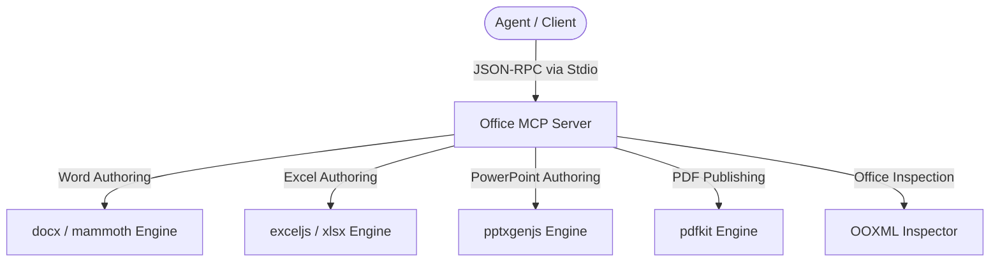

# Agy-MCP Blueprint: Office MCP 🏢

This MCP server provides a high-performance **5-tool Office Authoring & Publishing Suite** for AI agents. It provides native programmatic authoring and inspection capabilities for Microsoft Word (.docx), Microsoft Excel (.xlsx), Microsoft PowerPoint (.pptx), and PDF documents.

## 1. Architectural Overview



## 2. Tool Inventory (5 Tools)

| Tool Name | Format | Description |
| :--- | :--- | :--- |
| `write_word_document` | Word (.docx) | Create structured, styled Word documents with titles, sections, styled headings, bullet points, and tables. |
| `write_excel_sheet` | Excel (.xlsx) | Generate workbooks with multiple styled sheets, header formats, auto-column sizing, and typed rows. |
| `write_pdf_document` | PDF (.pdf) | Generate clean, formatted PDF documents with structured layouts, titles, sections, and tables. |
| `write_powerpoint_presentation` | PowerPoint (.pptx) | Create presentation slide decks with themes, slide layouts, bulleted content, and speaker notes. |
| `read_office_file` | Inspection | Inspect and extract text content and metadata from Office documents (.docx, .xlsx, .pptx). |

## 3. Setup Requirements

- **Runtime:** Node.js >= 18 (recommended) or Python >= 3.10
- **Node.js Libraries:** `docx`, `exceljs`, `pptxgenjs`, `pdfkit`, `mammoth`
- **Python Alternative Libraries:** `python-docx`, `openpyxl`, `python-pptx`, `reportlab`

## 4. Environment Configuration (`.env.example`)

```env
# Maximum rows permitted per generated Excel sheet
MAX_EXCEL_ROWS=100000

# Maximum slides permitted per PowerPoint deck
MAX_SLIDES=100
```

## 5. Security & Least Privilege Design

- **Path Sandboxing:** Target file output paths must reside within allowed workspace boundaries.
- **Atomic Write Strategy:** Complex document generation writes to a `.tmp` file before atomically moving to the final destination, preventing corrupted partial files.
- **Resource Constraints:** Enforced row, slide, and paragraph boundaries prevent memory spikes.

## 6. Client Manifest Example

```json
{
  "mcpServers": {
    "office": {
      "command": "node",
      "args": ["/path/to/office-mcp/index.js"],
      "env": {
        "MAX_EXCEL_ROWS": "100000",
        "MAX_SLIDES": "100"
      }
    }
  }
}
```

Verify deployment by calling `write_word_document` or `write_excel_sheet` to produce a sample document.

---
**Author:** JimmyR  
**Powered by:** AntigravityAI
