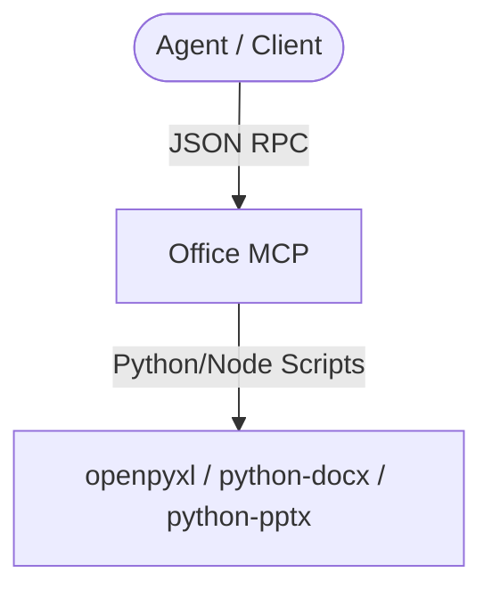

# Agy-MCP Blueprint: Office MCP 🏢

This MCP server provides standard integrations for Microsoft Office documents (Word, Excel, PowerPoint) and PDF operations, supporting parsing, generation, and modifications.

## 1. Architectural Overview

The Office MCP server acts as an interface between the agent and python/node libraries handling OOXML formats.



## 2. Setup Requirements

- **Runtime:** Node.js >= 18 or Python >= 3.10
- **Libraries:** python-docx, openpyxl, python-pptx (if Python) or docx, exceljs (if Node.js)

## 3. Environment Configuration (`.env.example`)

No credentials:
```env
# 🏢 OFFICE PARSING CONSTRAINTS
MAX_EXCEL_ROWS=100000
MAX_SLIDES=100
```

## 4. Least Privilege Design

- Document reads and writes are restricted to paths within allowlisted folders.
- Execution timeout controls prevent hang/denial-of-service during parsing of large files.

## 5. Atomic Write Strategy

- File modifications and writes are written to a `.tmp` file and atomically renamed to the destination.

## 6. Deployment / Verification Plan

Register the server:
```json
{
  "mcpServers": {
    "office": {
      "command": "python",
      "args": ["-m", "office_mcp"]
    }
  }
}
```
Verify by calling `read_word` or `read_excel` on a small test document.
