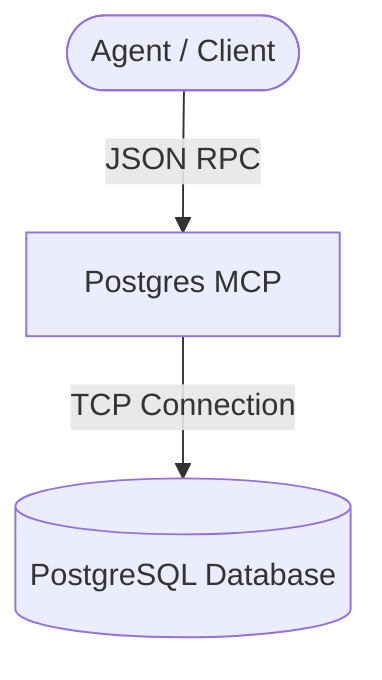

# Universal MCP Blueprint: Postgres MCP 🗄️

This MCP server provides a secure PostgreSQL connector, exposing schema discovery, query execution (read-only by default), query planning (EXPLAIN), and table definition lookups.

## 1. Architectural Overview

The Postgres MCP routes query requests from the agent to a database host.



## 2. Setup Requirements

- **Runtime:** Node.js >= 18
- **Database:** PostgreSQL >= 12 reachable on the network.

## 3. Environment Configuration (`.env.example`)

Align with vault structures for secret injection:
```env
# 🗄️ DATABASE CONFIGURATION
DB_HOST=${DB_HOST}
DB_PORT=5432
DB_USER=${DB_USER}
DB_DATABASE=${DB_DATABASE}
DB_PASSWORD=${VAULT_SECRET_DB_PASSWORD}
```

## 4. Least Privilege Design

- **Read-Only by Default:** All standard query execution should be scoped to a read-only database user (DML role app_runner).
- **Identifier Protection:** All schemas, tables, and column parameters enforce alphanumeric regex patterns to prevent SQL injection.

## 5. Atomic Write Strategy

- Non-applicable for reads. For migrations or write queries, transactions must be committed explicitly (`BEGIN; ... COMMIT;`).

## 6. Multi-Agent Deployment & Verification Plan

### ▶️ Si estás en Antigravity / Hermes Agent:
Configure this server in your agent's `mcp_config.json`:
```json
{
  "mcpServers": {
    "postgres": {
      "command": "npx",
      "args": ["-y", "mcp-server-postgres"]
    }
  }
}
```

### ▶️ Si estás en Cline / Roo Code:
Add to `.clinerules` / `.roo-code-instructions` or the global MCP settings:
```json
{
  "mcpServers": {
    "postgres": {
      "command": "npx",
      "args": ["-y", "mcp-server-postgres"]
    }
  }
}
```

### ⚠️ Si NO tienes soporte de MCP (Fallback):
- Guíe al usuario para ejecutar consultas directas a la base de datos usando `psql` o un cliente gráfico.
- Generar el código SQL exacto y pedir al usuario que pegue los resultados obtenidos.

Verify installation by calling `list_databases` or `list_tables`.
