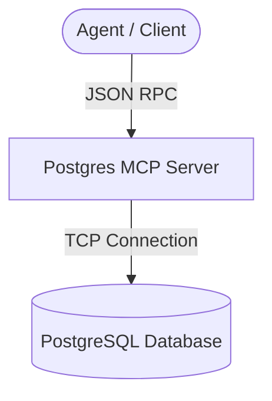

# Universal MCP Blueprint: Postgres MCP 🗄️

This MCP server provides a secure PostgreSQL connector, exposing schema discovery, query execution (read-only by default), query planning (EXPLAIN), and table definition lookups.

> [!WARNING]
> **Supply-Chain Security Alert (2026-09-28):**
> Do NOT use the legacy npm package `mcp-server-postgres`. On npm, that package was withdrawn and resolved to a `0.0.1-security` placeholder. Always use the verified PyPI distribution (`postgres-mcp`) or a custom in-house Node.js wrapper implementing this blueprint's schema.

## 1. Architectural Overview

The Postgres MCP routes query requests from the agent to a database host.


```mermaid
graph TD
    Agent([Agent / Client]) -->|JSON RPC| MCP[Postgres MCP Server]
    MCP -->|TCP Connection| DB[(PostgreSQL Database)]
```

## 2. Setup Requirements

- **Runtime:** Python >= 3.11 with `uv` / `uvx` OR Node.js >= 18 for custom wrapper.
- **Database:** PostgreSQL >= 12 reachable on the network.

## 3. Environment Configuration (`.env.example`)

Align with vault structures for secret injection:
```env
# 🗄️ DATABASE CONFIGURATION
DB_HOST=${DB_HOST}
DB_PORT=5432
DB_USER=${DB_USER}
DB_DATABASE=${DB_DATABASE}
DB_PASSWORD=${VAULT_SECRET_DB_PASSWORD}
```

## 4. Least Privilege Design

- **Read-Only by Default:** Standard query execution should be scoped to a read-only database user (DML role `app_runner`).
- **Identifier Protection:** All schemas, tables, and column parameters enforce alphanumeric regex patterns to prevent SQL injection.
- **Result Row Limit:** Enforce `max_rows` (default 50, maximum 250) to prevent buffer exhaustion.

## 5. Atomic Write Strategy

- Non-applicable for reads. For migrations or write queries, transactions must be committed explicitly (`BEGIN; ... COMMIT;`).

## 6. Multi-Agent Deployment & Verification Plan

### ▶️ If you are on Antigravity / Hermes Agent:
Configure this server in your agent's `mcp_config.json` using the verified PyPI package:
```json
{
  "mcpServers": {
    "postgres": {
      "command": "uvx",
      "args": ["postgres-mcp", "--access-mode=restricted"]
    }
  }
}
```
*Alternatively, for custom hardened Node.js wrapper:*
```json
{
  "mcpServers": {
    "postgres-mcp": {
      "command": "node",
      "args": ["./mcps/postgres-mcp/index.js"]
    }
  }
}
```

### ▶️ If you are on Cline / Roo Code / OpenCode:
Add to `.clinerules` / `.roo-code-instructions` or global MCP settings:
```json
{
  "mcpServers": {
    "postgres": {
      "command": "uvx",
      "args": ["postgres-mcp", "--access-mode=restricted"]
    }
  }
}
```

### ⚠️ If you do NOT have MCP support (Fallback):
- Guide the user to execute direct database queries using `psql` or a database GUI client.
- Generate the exact SQL query and request that the user paste the returned results.

Verify installation by calling `list_databases` or `list_tables`.

---
**Author:** JimmyR  
**Powered by:** AntigravityAI
