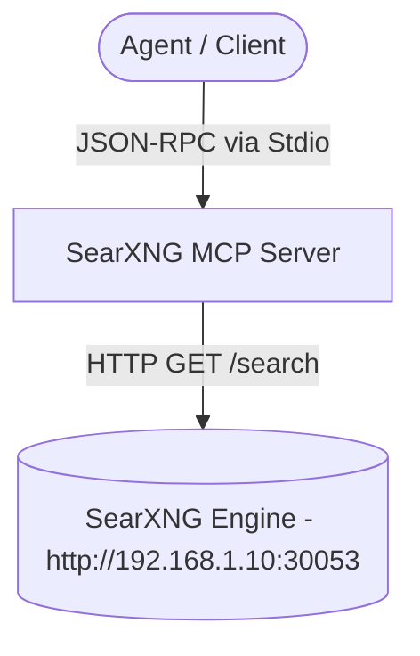

# Agy-MCP Blueprint: SearXNG Web Search MCP 🔍

This MCP server connects AI agents to a locally hosted SearXNG instance for privacy-respecting, customizable web search operations.

## 1. Architectural Overview



## 2. Setup & Installation

- **Location:** `P:\Infrastructure\MCP\searxng`
- **Runtime:** Node.js >= 18 (ES Modules)
- **Dependencies:** `@modelcontextprotocol/sdk`, `axios`, `zod`

```powershell
cd P:\Infrastructure\MCP\searxng
npm install
```

## 3. Server Requirement & Environment Configuration (`.env`)

SearXNG must have JSON format enabled in its `/etc/searxng/settings.yml`:
```yaml
search:
  formats:
    - html
    - json
```

Environment file (`.env`):
```env
# URL pointing to local or network SearXNG instance on TrueNAS
SEARXNG_URL=http://192.168.1.10:30053
```

## 4. Client Manifest Example

```json
{
  "mcpServers": {
    "searxng": {
      "command": "node",
      "args": [
        "P:/Infrastructure/MCP/searxng/index.js"
      ],
      "env": {
        "SEARXNG_URL": "http://192.168.1.10:30053"
      }
    }
  }
}
```

## 5. Tool Inventory

- **`web_search`**: Accepts a search `query`, optional `categories` (general, IT, science, news), and `pageno` for pagination.
