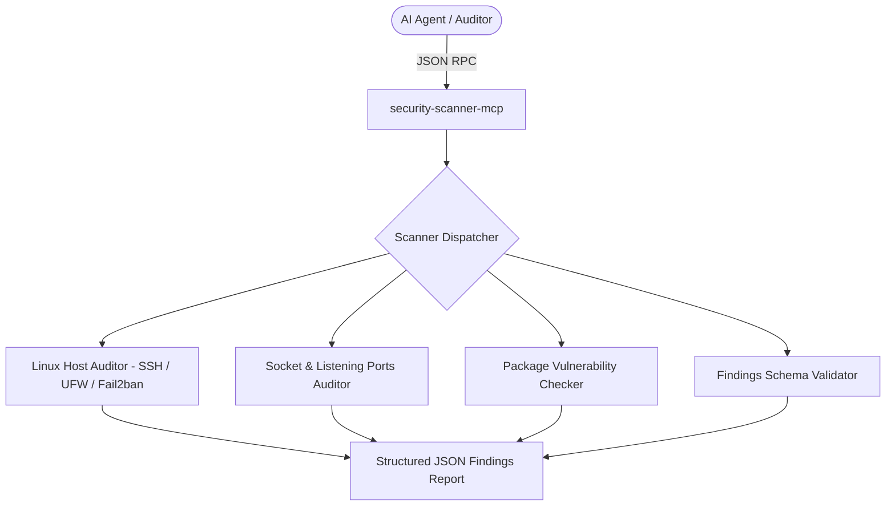

# Agy-MCP Blueprint: Security Scanner MCP 🛡️

The `security-scanner-mcp` is a specialized Model Context Protocol (MCP) server providing automated vulnerability scanning, host security audits, dependency CVE checks, and finding schema validations for coding agents.

## 1. Architectural Overview



## 2. Setup Requirements

- **Runtime:** Python >= 3.11 or Node.js >= 20 LTS
- **Core Dependencies:**
  - `pydantic` / `jsonschema` (schema validation)
  - `psutil` (socket and process inspection)
- **Execution Mode:** Read-only / Diagnostic. Never executes destructive mutations.

## 3. Environment Configuration (`.env.example`)

```env
# 🛡️ SECURITY SCANNER SETTINGS
SCAN_TARGET_HOST=localhost
ALLOWED_SCAN_SCOPES=dependencies,host,ports,findings_schema
REPORT_OUTPUT_DIR=./security-reports
```

## 4. Least Privilege Design

- **Read-Only Inspection:** Performs non-destructive reads of system states (`/etc/ssh/sshd_config`, listening sockets, lockfiles).
- **No Direct Shell String Execution:** All system queries are executed via array-argument subprocesses or native Python system libraries (`socket`, `psutil`).
- **Secret Redaction:** Automatically redacts API keys, credentials, and passwords found in scanned files.

## 5. Atomic Write Strategy

- When generating audit deliverables (`coverage-ledger.json`, `findings.json`, `REPORT.md`), writes are performed to `.tmp` files first and atomically replaced to prevent file corruption.

## 6. Tools Provided

1. `audit_host_security`: Audits SSH daemon settings, firewall status, and intrusion prevention configurations.
2. `audit_listening_ports`: Scans local listening sockets (`ss -tulpn`) and correlates them against firewall rules.
3. `validate_audit_findings`: Validates `findings.json` and `coverage-ledger.json` against Cloudflare's report schema.
4. `scan_dependency_vulnerabilities`: Audits project manifests (`package.json`, `requirements.txt`, `go.mod`) for known CVEs.

---
**Author:** JimmyR  
**Powered by:** AntigravityAI
