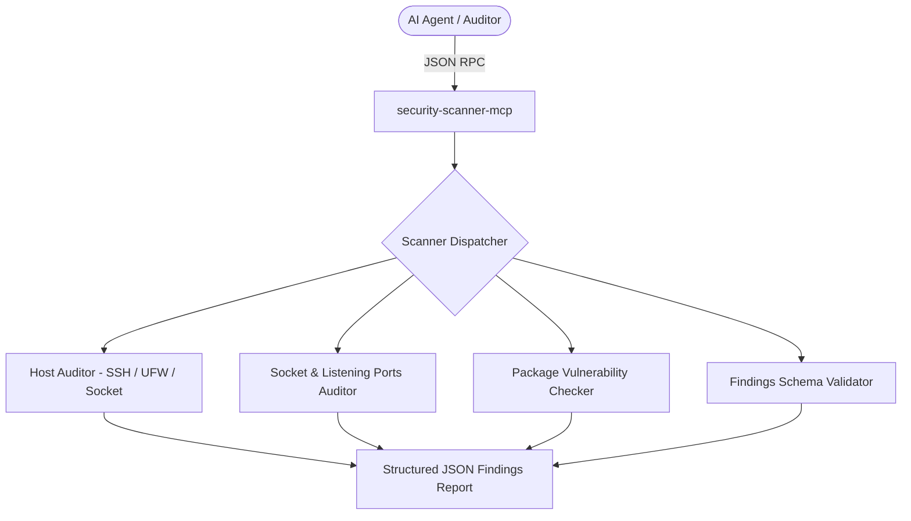

# Agy-MCP Blueprint: Security Scanner MCP 🛡️

The `security-scanner-mcp` is a specialized Model Context Protocol (MCP) server providing automated vulnerability scanning, host security audits, dependency CVE checks, and finding schema validations for coding agents.

## 1. Architectural Overview



## 2. Setup Requirements

- **Runtime:** Python >= 3.11 or Node.js >= 20 LTS
- **Core Dependencies:**
  - `pydantic` / `jsonschema` (schema validation)
  - `psutil` (socket and process inspection)
- **Execution Mode:** Read-only / Diagnostic. Never executes destructive mutations.

## 3. Environment Configuration (`.env.example`)

```env
# 🛡️ SECURITY SCANNER SETTINGS
SCAN_TARGET_HOST=localhost
ALLOWED_SCAN_SCOPES=dependencies,host,ports,findings_schema
REPORT_OUTPUT_DIR=./security-reports
```

## 4. Least Privilege Design

- **Read-Only Inspection:** Performs non-destructive reads of system states (`/etc/ssh/sshd_config`, listening sockets, lockfiles).
- **No Direct Shell String Execution:** All system queries are executed via array-argument subprocesses or native system libraries (`socket`, `psutil`).
- **Secret Redaction:** Automatically redacts API keys, credentials, and passwords found in scanned files.
- **Bounded Inputs:** All paths, hostnames, and scopes enforce regex patterns and maxLength caps in `schemas/tools.json`.

## 5. Atomic Write Strategy

- When generating audit deliverables (`coverage-ledger.json`, `findings.json`, `REPORT.md`), writes are performed to `.tmp` files first and atomically replaced to prevent file corruption.

## 6. Multi-Agent Deployment & Verification Plan

### ▶️ If you are on Antigravity / Hermes Agent:
Configure in `mcp_config.json`:
```json
{
  "mcpServers": {
    "security-scanner": {
      "command": "node",
      "args": ["./mcps/security-scanner-mcp/index.js"]
    }
  }
}
```

### ▶️ If you are on Cline / Roo Code / OpenCode:
```json
{
  "mcpServers": {
    "security-scanner": {
      "command": "node",
      "args": ["./mcps/security-scanner-mcp/index.js"]
    }
  }
}
```

### ⚠️ If you do NOT have MCP support (Fallback):
- Run standard audit tools directly in terminal:
  - For CVEs: `npm audit`, `pip-audit`, or `govulncheck ./...`
  - For ports: `netstat -ano` (Windows) or `ss -tulpn` (Linux)
  - For findings validation: Run custom validation script against JSON schema.

Verify installation by calling `audit_listening_ports` with protocol `"all"`.

---
**Author:** JimmyR  
**Powered by:** AntigravityAI
