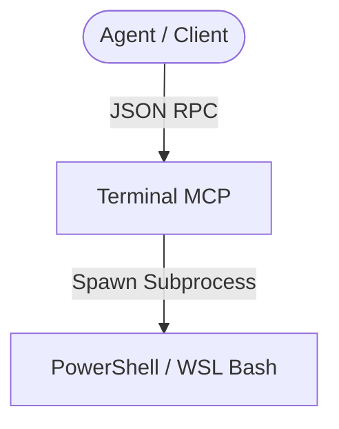

# Agy-MCP Blueprint: Terminal MCP 💻

This MCP server provides restricted, validated command-line execution capabilities, supporting PowerShell (Windows) or WSL/Bash (Linux) dual-mode with timeouts and argument limits.

## 1. Architectural Overview

The Terminal MCP server validates commands against safety rules and executes them in subprocesses.



## 2. Setup Requirements

- **Runtime:** Node.js >= 18 or Python >= 3.10
- **Shells:** PowerShell (Windows) or bash (WSL/Linux).

## 3. Environment Configuration (`.env.example`)

No credentials in configuration. Allowed command patterns configurations:
```env
# 💻 ALLOWED COMMAND PREFIXES (Comma-separated)
ALLOWED_COMMAND_PREFIXES=git,npm,pip,python,docker
```

## 4. Least Privilege Design

- **No Raw Shell Concatenation:** Commands are executed as child processes with strict array-based parameter parsing.
- **Command Length Bounds:** Raw command string length is capped at 100 characters.
- **Args Cap:** Maximum arguments array size is capped at 50.
- **Command Allowlist:** Only commands matching allowlisted executables (e.g. `git`, `npm`) are executed. Destructive commands (e.g. `rm -rf /`) are blocked at the validation layer.

## 5. Atomic Write Strategy

- Output buffers are handled in-memory and returned as JSON. If outputting log files, atomic rename must be used.

## 6. Deployment / Verification Plan

Register the terminal server:
```json
{
  "mcpServers": {
    "terminal": {
      "command": "python",
      "args": ["-m", "terminal_mcp"]
    }
  }
}
```
Verify by executing `git status` via the MCP.
