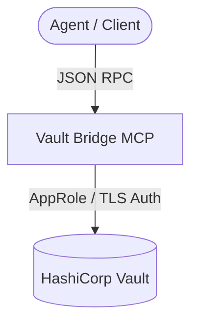

# Universal MCP Blueprint: Vault Bridge MCP 🔐

This MCP server acts as a secure bridge to HashiCorp Vault, providing secret retrieval, creation, namespace administration, and secret access audits.

## 1. Architectural Overview

The Vault Bridge MCP connects local sessions to HashiCorp Vault API endpoints, strictly separating namespaces.



## 2. Setup Requirements

- **Runtime:** Node.js >= 18 or Python >= 3.10
- **Vault:** HashiCorp Vault reachable on the network.

## 3. Environment Configuration (`.env.example`)

Inject AppRole credentials or tokens using project environment bindings:
```env
# 🔐 VAULT INTEGRATION
VAULT_ADDR=https://vault.internal.network:8200
VAULT_ROLE_ID=${VAULT_ROLE_ID}
VAULT_SECRET_ID=${VAULT_SECRET_ID}
```

## 4. Least Privilege Design

- **Namespace Scope:** AppRole access is restricted to specific namespaces (`dev`, `staging`, `production`).
- **Input Validation:** Key paths enforce strict alphanumeric and slash/hyphen pattern checks.

## 5. Atomic Write Strategy

- Secret updates (`put_secret`) are handled atomically by Vault's backend.

## 6. Multi-Agent Deployment & Verification Plan

### ▶️ Si estás en Antigravity / Hermes Agent:
Configure in `mcp_config.json`:
```json
{
  "mcpServers": {
    "vault-bridge": {
      "command": "node",
      "args": ["dist/vault_bridge_mcp.js"]
    }
  }
}
```

### ▶️ Si estás en Cline / Roo Code:
Add to the user's active configuration file:
```json
{
  "mcpServers": {
    "vault-bridge": {
      "command": "node",
      "args": ["dist/vault_bridge_mcp.js"]
    }
  }
}
```

### ⚠️ Si NO tienes soporte de MCP (Fallback):
- Guíe al usuario para obtener o registrar secretos usando la CLI oficial de Vault (`vault kv get`).
- Indique al desarrollador que inyecte las variables en su entorno local de desarrollo.

Verify operation by calling `list_secrets` on a non-production path.
