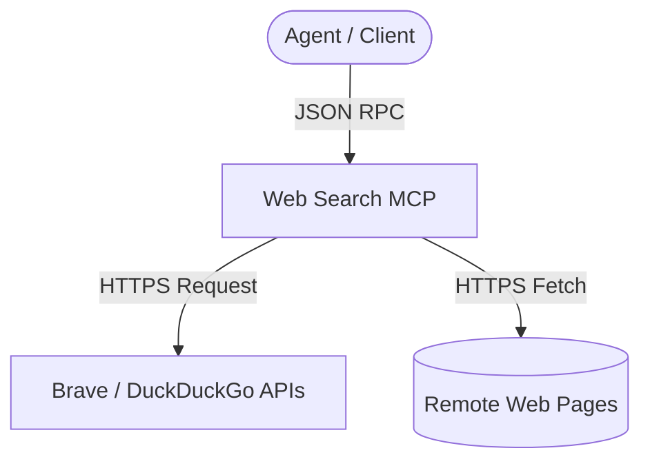

# Agy-MCP Blueprint: Web Search MCP 🌐

This MCP server provides search engine queries and web content fetching capabilities with strict HTTPS constraints and length validation.

## 1. Architectural Overview

The Web Search MCP queries public search providers (like Brave, DuckDuckGo) or scrapes web pages, parsing the response to Markdown.



## 2. Setup Requirements

- **Runtime:** Node.js >= 18 or Python >= 3.10
- **API Keys:** Brave API key (optional for search) or standard HTTP scraping headers.

## 3. Environment Configuration (`.env.example`)

Inject credentials via Vault:
```env
# 🌐 SEARCH PROVIDER KEYS
BRAVE_API_KEY=${VAULT_SECRET_BRAVE_API_KEY}
```

## 4. Least Privilege Design

- **HTTPS Enforcement:** Fetching URLs is strictly restricted to HTTPS protocol schemes to prevent cleartext credential leakage or MITM attacks.
- **Query Length Cap:** Search query parameter length is limited to 500 characters.
- **Results Bounds:** Results collection size is capped at 10 items to prevent network/memory buffer overflows.

## 5. Atomic Write Strategy

- Content fetched is returned directly to the agent session as text JSON, avoiding local storage writes.

## 6. Deployment / Verification Plan

Deploy using node:
```json
{
  "mcpServers": {
    "web-search": {
      "command": "npx",
      "args": ["-y", "@modelcontextprotocol/server-web-search"]
    }
  }
}
```
Verify by running `search_web` with query "mcp specification".
