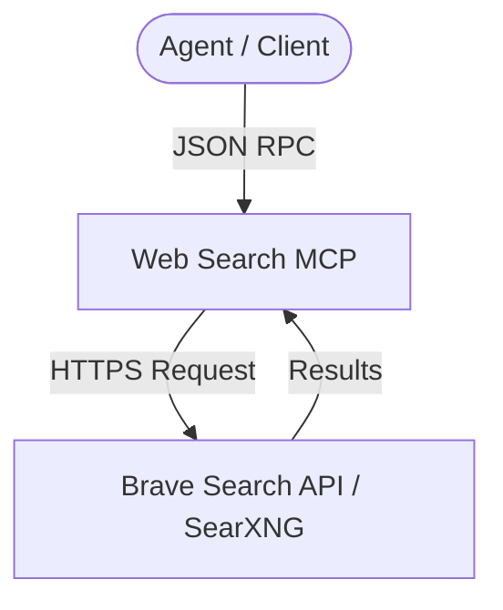

# Agy-MCP Blueprint: Web Search MCP 🌐

This MCP server provides web search querying and citation extraction capabilities with strict HTTPS constraints, character caps, and rate limits.

> [!NOTE]
> **Implementation Mapping:** The maintained upstream server is `@brave/brave-search-mcp-server`, exposing `brave_web_search`. For document or web page fetching, pair this server with `markitdown-mcp` (`convert_to_markdown`) or local SearXNG.

## 1. Architectural Overview

The Web Search MCP queries public search providers (such as Brave Search or SearXNG) and returns formatted search results with citations.


```mermaid
graph TD
    Agent([Agent / Client]) -->|JSON RPC| MCP[Web Search MCP]
    MCP -->|HTTPS Request| Search[Brave Search API / SearXNG]
    Search -->|Results| MCP
```

## 2. Setup Requirements

- **Runtime:** Node.js >= 18
- **API Keys:** Brave API key (configured in Vault) or access to a SearXNG instance.

## 3. Environment Configuration (`.env.example`)

Inject credentials via Vault:
```env
# 🌐 SEARCH PROVIDER KEYS
BRAVE_API_KEY=${VAULT_SECRET_BRAVE_API_KEY}
```

## 4. Least Privilege Design

- **Query Length Cap:** Search query parameter length is limited to 500 characters.
- **Results Bounds:** Results collection size is capped at 10 items to prevent context window saturation.
- **HTTPS Enforcement:** All outbound requests strictly require HTTPS.

## 5. Atomic Write Strategy

- Content fetched is returned directly to the agent session as text JSON, avoiding local storage writes.

## 6. Multi-Agent Deployment & Verification Plan

### ▶️ If you are on Antigravity / Hermes Agent:
Deploy using the verified Brave Search package:
```json
{
  "mcpServers": {
    "web-search": {
      "command": "npx",
      "args": ["-y", "@brave/brave-search-mcp-server"],
      "env": {
        "BRAVE_API_KEY": "${VAULT_SECRET_BRAVE_API_KEY}"
      }
    }
  }
}
```

### ▶️ If you are on Cline / Roo Code / OpenCode:
```json
{
  "mcpServers": {
    "web-search": {
      "command": "npx",
      "args": ["-y", "@brave/brave-search-mcp-server"],
      "env": {
        "BRAVE_API_KEY": "${VAULT_SECRET_BRAVE_API_KEY}"
      }
    }
  }
}
```

### ⚠️ If you do NOT have MCP support (Fallback):
- Use built-in web search capabilities (e.g. Antigravity's `search_web`).
- Guide the user to perform the search manually and share relevant documentation snippets.

Verify by running `brave_web_search` with query "model context protocol".

---
**Author:** JimmyR  
**Powered by:** AntigravityAI
